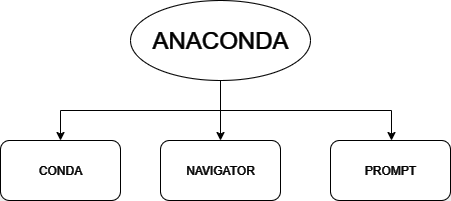

# Animali fantastici .... Anaconda

## Come dice il titolo parliamo ovviamente di anaconda la ... piattaforma di sviluppo realizzata per il mondo del data science. 

### Come si può intuire è uno strumento ormai fondamentale nel mondo odierno. 
### Semplifica sensibilmente il processo di setup di un ambiente di sviluppo per il Data  Science con Python, racchiudendo in una sola distribuzione tutto ciò di cui si ha bisogno per iniziare da subito a programmare: un ambiente di sviluppo integrato chiamato Spyder, Jupiter Notebook, l'interprete Python, un gestore di package e ambienti virtuali dedicato chiamato Conda, e circa 300 librerie installate e pronte all'uso come Pandas, NLTK, Numpy, Matplotlib, Requests, SQLAlchemy e così via.



## CONDA
```
Lo strumento principale è Conda, il gestore di pacchetti open source per Python.
Conda permette di creare ambienti virtuali indipendenti l'uno dall'altro, in modo
da poter installare e gestire diverse versioni di librerie e pacchetti senza che 
questi entrino in conflitto tra loro. Si tratta di uno strumento molto popolare 
soprattutto nella comunità scientifica e di analisi dei dati perché semplifica 
la gestione di progetti complessi.
```
## NAVIGATOR
```
Ci permette di gestire tutti gli aspetti della piattaforma, semplificando 
il ulteriormente il processo di personalizzazione della distro.
```
## PROMPT
```
Oltre alla possibilità di utilizzare Conda sulle shell di sistema, la distribuzione 
di Anaconda fornisce anche un’interfaccia a riga di comando dedicata, chiamata 
Anaconda Prompt, disponibile per Windows e per Linux.

Con Anaconda Prompt è possibile gestire gli ambienti virtuali, crearne di nuovi, 
attivarli e disattivarli, installare e aggiornare librerie e molto altro. 
Permette anche un accesso rapido ai comandi di sistema, come la navigazione 
tra cartelle, la creazione di file e l'esecuzione di script.
```